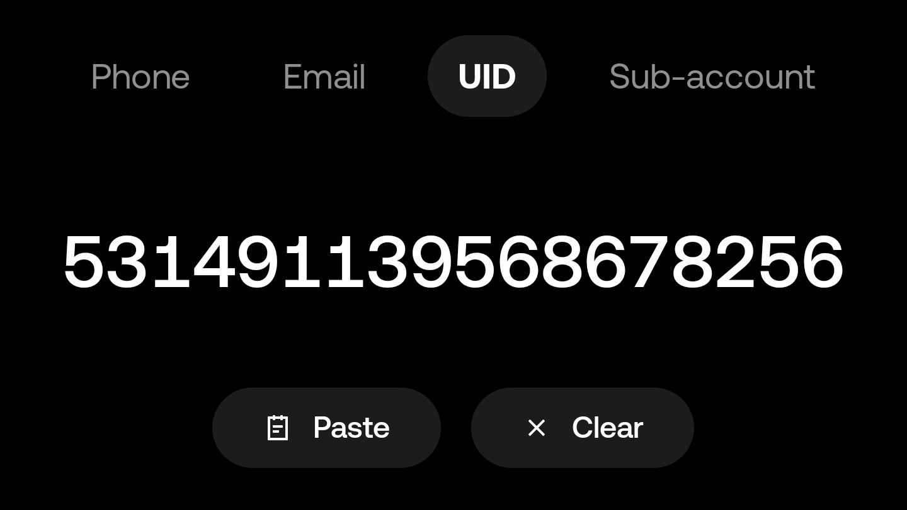

<!-- # OKX加密货币购物流程

**本文面向初次使用加密货币的顾客，是使用OKX购买美元稳定币USDT并将其用于支付货款的流程**

**加密货币**是一种基于密码学和区块链的数字资产，我们使用它主要是为了降低交易手续费。在本案例中，您会被收取0手续费。**稳定币**是一种特殊类型的加密货币，其价值通常与某种法定货币（如美元）或其他资产（如黄金）挂钩，旨在保持价格稳定，避免传统加密货币的剧烈波动。**USDT**是最流行和使用最广泛的美元稳定币之一，其价值与美元1:1挂钩，目前广泛应用于加密货币交易和跨境支付。**OKX**是全球领先的加密货币交易平台之一，用户可以在OKX上安全地买卖和管理加密资产。

Agent使用OKX作为加密货币钱包，主要接受USDT作为交易货币。考虑到传统跨境支付方式（如PayPal、SWIFT银行转账）手续费和提现成本高昂，以及Alipay等工具的国际使用受限，我们强烈推荐您使用加密货币支付货款。本文将详细指导您如何**安全、快速、便捷地**通过OKX购买USDT，并将其转账给Agent完成P2P交易。

**本教程强烈建议大家使用手机版OKX App买币并完成交易。这是因为在大多数情况下，手机比电脑更少遭遇各种恶意软件、钓鱼链接和安全漏洞等。**

## 第一步，下载OKX App (手机应用)

使用agent的OKX邀请链接<https://okx.com/join/49819258>下载OKX官方App，邀请双方都可能获得一些奖金。您也可以直接从Google Play或App Store下载OKX

## 第二步，注册、登录并完成身份认证 (KYC)

在OKX上进行P2P交易和提币（包括内部转账），必须先完成身份认证（Know Your Customer, KYC）。请按照App指引，可能需要上传身份证件并完成人脸识别。

（可选）使用agent的OKX邀请链接 <https://okx.com/join/49819258> 或邀请码 `49819258` 注册账号，双方都可能获得一些奖金。

（可选）扫码添加agent为OKX联系人。

## 第三步，P2P买币（法币交易）

**请务必严格遵循OKX提供的购买步骤，谨防资金损失！**

在OKX App首页，点击"P2P trading"并根据应用内指引选择一种方式购买usdt

## 第四步，将USDT转账给Agent

选择您要转账的货币（一般来说是usdt）

New destinations > OKX users > UID > 531491139568678256 （为避免资金损失，请直接复制该UID而非手动打字）

您也可以通过 Saved destinations > Address book > Add recipient > OKX users > UID > 531491139568678256 来将agent保存到常用商户中

如果OKX询问收款人的真实姓名，请填写“张君一”

## 第五步，确认并完成转账

在最终确认页面，请**务必仔细核对收款人UID和转账金额是否正确。**

转账成功后，您可以在Assets > History中查看转账状态。

 -->

# OKX Cryptocurrency Payment Guide

**This guide is for customers new to cryptocurrency and outlines the process of purchasing the US dollar stablecoin, USDT, on OKX and using it to pay for goods.**

**Cryptocurrency** is a digital asset based on cryptography and blockchain technology. We primarily use it to lower transaction fees. In this case, you will be charged zero fees. A **stablecoin** is a special type of cryptocurrency whose value is typically pegged to a fiat currency (like the US dollar) or another asset (like gold), designed to maintain a stable price and avoid the significant volatility of traditional cryptocurrencies. **USDT** is one of the most popular and widely used US dollar stablecoins, pegged 1:1 to the US dollar, and is now widely used in cryptocurrency trading and cross-border payments. **OKX** is one of the world's leading cryptocurrency exchange platforms, where users can safely buy, sell, and manage their crypto assets.

The Agent uses OKX as their cryptocurrency wallet and primarily accepts USDT as the payment currency. Considering the high fees and withdrawal costs of traditional cross-border payment methods (like PayPal, SWIFT bank transfers) and the limited international usability of tools like Alipay, we strongly recommend using cryptocurrency to pay for your goods. This guide will walk you through how to **safely, quickly, and conveniently** purchase USDT on OKX and transfer it to the Agent to complete the P2P transaction.

**This tutorial strongly recommends using the mobile OKX App to buy crypto and complete the transaction. This is because, in most cases, mobile phones are less susceptible to various types of malware, phishing links, and security vulnerabilities than computers.**

## Step 1: Download the OKX App (Mobile Application)

Use the Agent's OKX invitation link <https://okx.com/join/49819258> to download the official OKX App; both parties may receive a bonus. You can also download the OKX app directly from the Google Play Store or Apple App Store.

## Step 2: Register, Log In, and Complete Identity Verification (KYC)

To conduct P2P trading and withdraw funds (including internal transfers) on OKX, you must first complete Identity Verification (Know Your Customer, KYC). Please follow the in-app instructions. This may require uploading an ID document and completing a facial recognition scan.

(Optional) Use the Agent's OKX invitation link <https://okx.com/join/49819258> or invitation code `49819258` to register an account; both parties may receive a bonus.

(Optional) Scan the QR code to add the Agent as a contact on OKX.

## Step 3: Buy Crypto via P2P Trading (Fiat Transaction)

**Please strictly follow the purchasing steps provided by OKX to prevent any loss of funds!**

On the OKX App homepage, tap "P2P trading" and follow the in-app instructions to purchase USDT.

## Step 4: Transfer USDT to the Agent

Select the currency you want to transfer (typically USDT).

Navigate to: New destinations > OKX users > UID > 531491139568678256 (To avoid loss of funds, please copy this UID directly instead of typing it manually.)

You can also save the Agent to your address book for future use by navigating to: Saved destinations > Address book > Add recipient > OKX users > UID > 531491139568678256

If OKX asks for the recipient's real name, please enter 张君一

## Step 5: Confirm and Complete the Transfer

On the final confirmation screen, **be sure to carefully double-check that the recipient's UID and the transfer amount are correct.**

After the transfer is successful, you can check its status under Assets > History.
